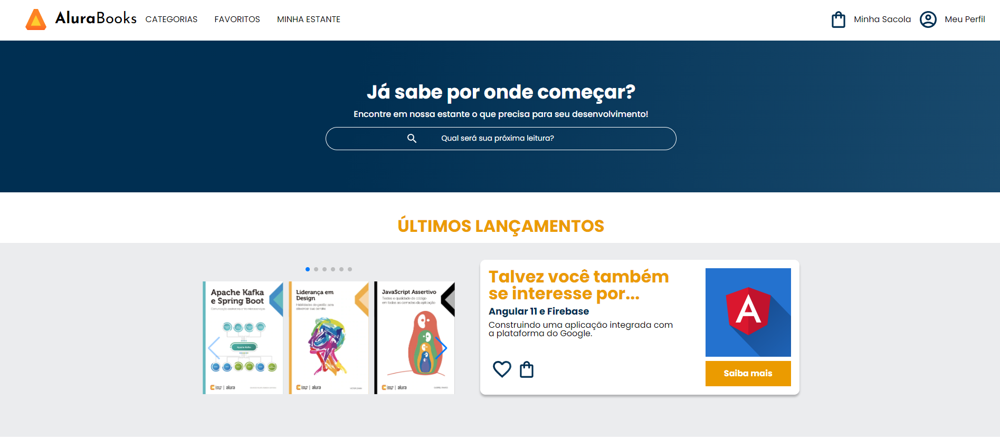

# Alura Books

Bem-vindo ao repositório do Alura Books! Este projeto é uma vitrine de livros online inspirada na plataforma de cursos Alura. Aqui você encontrará uma interface interativa para explorar, pesquisar e conhecer os lançamentos e best-sellers da biblioteca.

## Índice
1. [Descrição](#descrição)
2. [Tecnologias Utilizadas](#tecnologias-utilizadas)
3. [Como Funciona](#como-funciona)
4. [Deploy](#deploy)
5. [Contato](#contato)

## Descrição
O Alura Books foi desenvolvido como parte dos meus estudos na faculdade e representa um marco na minha jornada de aprendizado em desenvolvimento web. O projeto inclui um cabeçalho de navegação, banners, seções de carrossel com os livros mais recentes e mais vendidos, além de uma área de cadastro de e-mail para novidades.

## Tecnologias Utilizadas
- HTML5
- CSS3
- Swiper.js (para os carrosséis)
- Google Fonts (Poppins e Josefin Sans)

## Como Funciona
Este projeto é composto por um único arquivo HTML, complementado por arquivos CSS e imagens. Utiliza a API Swiper.js para criar carrosséis interativos que mostram os livros disponíveis. A estrutura do site é responsiva, proporcionando uma boa experiência de navegação em dispositivos móveis e desktops.

### Estrutura de Arquivos
- `index.html`: Estrutura principal do site.
- `styles.css`: Estilos principais.
- `reset.css`: Reset de estilos padrão.
- `header.css`, `banner.css`, `carrossel.css`, `topicos.css`, `contato.css`, `rodape.css`: Estilos específicos para diferentes seções da página.
- `images/`: Contém todas as imagens utilizadas no projeto.

### Responsividade
A interface do Alura Books foi projetada para ser totalmente responsiva. Isso significa que o layout se ajusta automaticamente para fornecer uma experiência de usuário otimizada em diversos tamanhos de tela, desde smartphones e tablets até monitores de desktop.

## Deploy
Você pode acessar o site do Alura Books através deste [link](#).

## Contato
Este projeto é um trabalho em andamento e faz parte da minha formação como desenvolvedor. Se você tiver sugestões ou quiser entrar em contato, pode me encontrar em:

- **Email:** fabiooprogramador@gmail.com
- **LinkedIn:** [Fabio Fernandes](https://www.linkedin.com/in/fabiogmf/)

Agradeço por visitar meu projeto e espero que goste da experiência de navegação pelo Alura Books! 🚀📚

Criado com 💙 por Fabio Fernandes